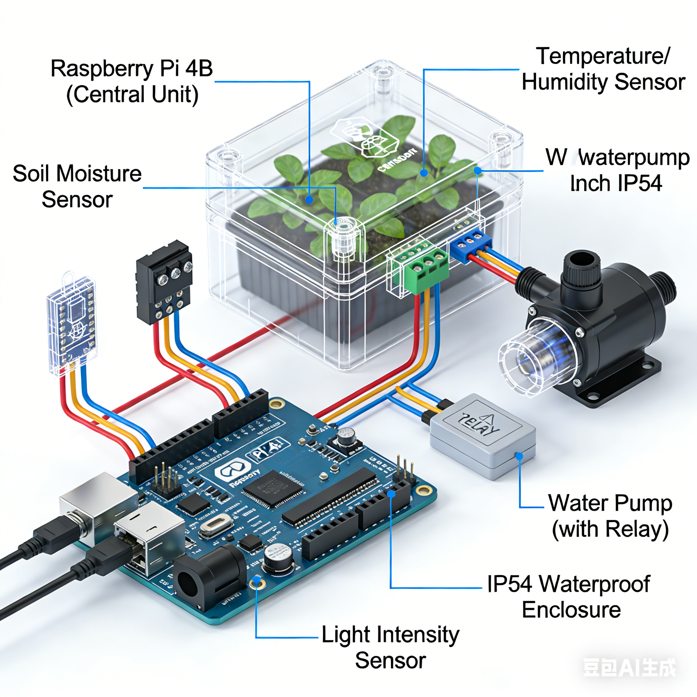
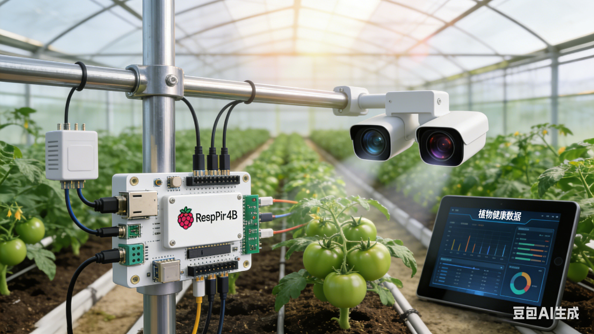

# AgriSense - 智能大棚监控系统

基于 AI 的智能农业环境监控与决策系统

## 项目概述

AgriSense 是一个面向智能大棚的农业监控系统，集成了环境传感器、土壤监测、计算机视觉和 AI 决策功能，帮助用户实时监控作物生长环境并提供智能管理建议。

## 系统架构

```
┌─────────────────────────────────────────────────────────────┐
│                      AgriSense 主系统                       │
├─────────────────────────────────────────────────────────────┤
│  ┌──────────────┐  ┌──────────────┐  ┌──────────────┐      │
│  │  传感器模块   │  │  视觉分析模块 │  │  决策模块     │      │
│  │              │  │              │  │              │      │
│  │ - 环境传感器  │  │ - 叶片病害   │  │ - 规则引擎   │      │
│  │ - 土壤传感器  │  │ - 生长测量   │  │ - LLM 顾问    │      │
│  │ - 相机模块   │  │              │  │              │      │
│  └──────────────┘  └──────────────┘  └──────────────┘      │
│                            │                                │
│                            ▼                                │
│  ┌──────────────┐  ┌──────────────────────────────┐        │
│  │  控制模块     │  │      Web 界面                │        │
│  │              │  │                              │        │
│  │ - 执行器控制  │  │ - 实时监控                   │        │
│  │ - GPIO 集成   │  │ - 设备控制                   │        │
│  └──────────────┘  └──────────────────────────────┘        │
└─────────────────────────────────────────────────────────────┘
```

## 功能模块详解

### 1. 传感器模块 (src/sensors/)

#### 1.1 环境传感器 (environment.py)
- **功能**: 温度、湿度、光照强度、CO2 浓度监测
- **支持硬件**: BME680、SCD30 等传感器
- **模拟模式**: 当硬件不可用时自动切换到模拟数据
- **特色功能**:
  - 光合作用有效辐射 (PAR) 估算
  - 光合作用速率计算
  - 环境状态评估与建议

#### 1.2 土壤传感器 (soil_moisture.py)
- **功能**: 多点土壤湿度监测（支持 3 个点位）
- **支持硬件**: RPi.GPIO + ADC 传感器
- **功能特性**:
  - 湿度阈值判断（干燥/最佳/过湿）
  - 平均湿度计算
  - 灌溉决策支持

#### 1.3 相机模块 (camera.py)
- **功能**: 图像采集
- **支持硬件**: Raspberry Pi 摄像头
- **分辨率**: 640x480 (可配置)

### 2. 视觉分析模块 (src/vision/)

#### 2.1 叶片病害分析 (leaf_disease.py)
- **病害类型**:
  - 白粉病、霜霉病、叶斑病
  - 炭疽病、脐腐病、早疫病、晚疫病
- **营养缺乏检测**: 缺氮、缺磷、缺钾、缺镁、缺铁、缺钙
- **虫害检测**: 蚜虫、红蜘蛛、白粉虱、蓟马、介壳虫
- **技术实现**:
  - 基于 OpenCV 的颜色特征分析
  - 支持 TensorFlow/CNN 模型（可选）
  - 健康评分系统（0-100）

#### 2.2 生长测量 (growth_measure.py)
- **功能**: 作物生长状态分析
- **输出**: 生长阶段判断、生长率估算

### 3. 决策模块 (src/decision/)

#### 3.1 规则引擎 (rules_engine.py)
- **决策规则**:
  - 温度控制：18-32°C 最佳范围
  - 湿度控制：45-75% 最佳范围
  - 土壤湿度：35-65% 最佳范围
- **动作类型**: 灌溉、补光、通风、遮阳

#### 3.2 LLM 顾问 (llm_advisor.py)
- **支持模型**:
  - Qwen3.5 (本地 Ollama)
  - GPT-4o-mini (OpenAI)
- **功能**:
  - 智能决策建议（30 字以内）
  - 每日生长报告
  - 综合环境分析

### 4. 控制模块 (src/control/)

#### 执行器控制 (actuator.py)
- **设备控制**:
  - 灌溉系统 (GPIO 17)
  - 补光系统 (GPIO 27)
  - 通风系统 (GPIO 22)
  - 遮阳系统 (GPIO 23)
- **功能**:
  - 开关控制
  - 状态查询
  - 紧急停止

### 5. Web 界面 (src/web/)

- **框架**: Flask
- **功能**:
  - 实时传感器数据展示
  - 设备可视化控制
  - AI 决策建议展示

## 项目结构

```
AgriSense/
├── src/
│   ├── main.py               # 主入口
│   ├── sensors/
│   │   ├── environment.py    # 环境传感器
│   │   ├── soil_moisture.py  # 土壤传感器
│   │   └── camera.py         # 相机模块
│   ├── vision/
│   │   ├── leaf_disease.py   # 叶片病害分析
│   │   └── growth_measure.py # 生长测量
│   ├── decision/
│   │   ├── rules_engine.py   # 规则引擎
│   │   └── llm_advisor.py    # LLM 顾问
│   ├── control/
│   │   └── actuator.py       # 执行器控制
│   └── web/
│       ├── app.py            # Flask Web 应用
│       └── templates/
│           └── index.html    # Web 界面
├── rendering/                # 渲染图集
│   ├── concept_art.png       # 概念图
│   └── ui_mockup.png         # UI原型
├── log/                      # 系统日志
├── config.json               # 配置文件
├── requirements.txt          # Python 依赖
├── AgriSense_Requirements.md # 本文件
└── README.md                 # 介绍文档
```

## 项目渲染


## 运行模式

### 模拟模式 (Simulation Mode)
- 适用于开发和测试
- 自动生成模拟传感器数据
- 无需真实硬件连接

### 硬件模式 (Hardware Mode)
- 连接真实传感器和执行器
- 需要 Raspberry Pi 硬件
- 需要安装相应驱动

## 开发计划

- [ ] 添加数据持久化 (SQLite)
- [ ] 实现历史数据图表展示
- [ ] 添加用户认证系统
- [ ] 支持多大棚管理
- [ ] 移动端适配
- [ ] 添加更多病害识别模型
- [ ] 实现自动化控制策略优化