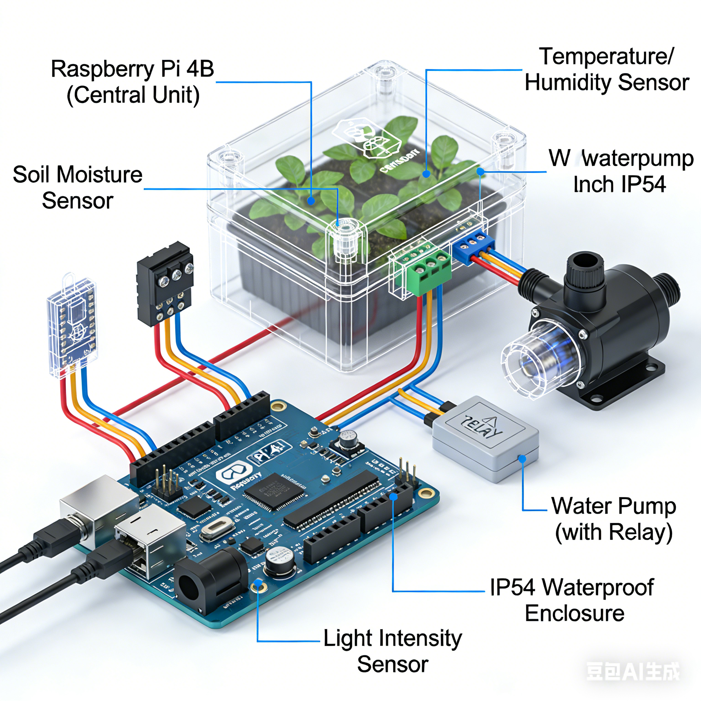
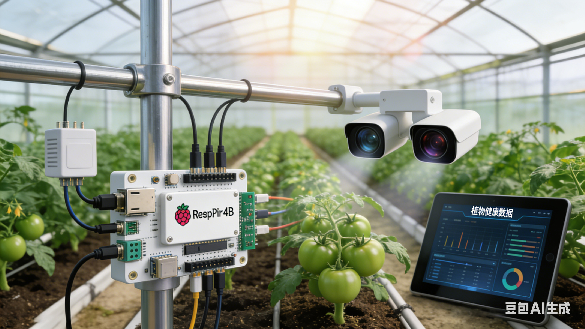

> **⏸️ 暂停维护** · 最近提交：2026-04-22（约 5 个月前）
>
> 课程项目已完成阶段性目标；受硬件条件限制暂停迭代，待设备与场地就绪后继续。

<div align="center">

# 🌱 AgriSense · 智能大棚监测系统

**基于树莓派的 AI 智能农业环境监控与决策系统**

多维度传感器采集 · 计算机视觉分析 · 规则引擎 + LLM 双轨决策

   

</div>

---

## 🎯 项目定位

AgriSense 是一个基于**树莓派**的 AI 智能大棚监测系统：通过多维度传感器数据采集与计算机视觉分析，实现作物生长全周期的科学化、精准化管理。

系统如同一位 24 小时在线的农业专家 —— 实时监测土壤湿度、叶片健康、植株生长状态及光合作用强度，并基于数据分析给出最优农事建议。

### ⭐ 核心特性：零硬件依赖

**全模块支持模拟模式** —— 没有树莓派、没有传感器也能完整跑通整条链路，便于课堂演示与开发调试。硬件就绪后切换开关即可上真机。

## ✨ 功能特性

| 模块 | 能力 |
|------|------|
| **多传感器融合** | 温度 / 湿度 / 光照 / CO₂ / 气压 / VOC + **3 点位土壤湿度** |
| **双轨决策** | 规则引擎（确定性阈值）+ LLM 顾问（语义建议），互为补充 |
| **叶片病害分析** | OpenCV 颜色分析 + 健康评分 0-100，可识别营养缺乏 / 虫害类别 |
| **CNN 病害识别** | TensorFlow Keras 番茄叶片 **10 类病害**，输入 128×128 |
| **AI 多轮对话** | 注入传感器上下文、展示思考过程、支持动态切换模型 |
| **执行器控制** | 灌溉 / 补光 / 通风 / 遮阳 + **紧急停止** |
| **每日生长报告** | 汇总当日环境与决策，生成可读报告 |
| **照片管理** | 拍照 / 上传分析 / 列表 / 删除 / 清空 |
| **Flutter 移动端** | 监控 / 控制 / AI 对话 / 图表 / 主题，含 APK 构建引导 |

### 📸 界面预览

| 概念图 | UI 原型 |
|:------:|:-------:|
|  |  |

## 🔧 硬件规格

> 引脚与 I2C 地址**逐字来自 `config.json`**，可直接照此接线。

| 设备 | 接口 / 引脚 | 说明 |
|------|:----------:|------|
| **BME680** | I2C `0x76` | 环境传感器（温 / 湿 / 气压 / VOC） |
| SCD30 | I2C `0x61` | CO₂ 传感器 ⚠️ 见「已知问题」 |
| 土壤湿度 ×3 | RPi.GPIO + ADC | 3 点位独立采集 |
| 灌溉系统 | GPIO **17** | 继电器控制 |
| 补光系统 | GPIO **27** | LED 补光灯 |
| 通风系统 | GPIO **22** | 排气风扇 |
| 遮阳系统 | GPIO **23** | 遮阳网电机 |
| 摄像头 | — | 640×480 @ 30 fps |

## ⚙️ 决策规则（逐字来自 `config.json`）

| 指标 | 下限 | 上限 | 低于下限 | 高于上限 |
|------|:----:|:----:|---------|---------|
| 温度 temperature | 18 | 32 | 开启补光，关闭通风 | 开启通风，关闭补光 |
| 湿度 humidity | 45 | 75 | 减少通风 | 加强通风 |
| 土壤湿度 soil_moisture | 35 | 65 | 开启灌溉 | 关闭灌溉 |

视觉分析置信度阈值：`leaf_disease.confidence_threshold = 0.7`

## 🛠️ 技术栈

| 层 | 实现 |
|----|------|
| Web 服务 | **Flask** ≥2.3 + Flask-CORS（4 个页面：`/` `/controller` `/simulator` `/mobile`） |
| 计算机视觉 | **OpenCV** ≥4.8（颜色分析） + **TensorFlow** ≥2.13（Keras CNN） |
| 数据处理 | numpy · pandas · scikit-learn · Pillow |
| LLM 接入 | **Ollama** 本地推理（`gemma4:e4b` / `qwen3.5:9b`） + OpenAI 兼容接口 |
| 硬件层 | RPi.GPIO · smbus2（**在 requirements 中被注释**，需真机时手动启用） |
| 工程化 | pytest · black · flake8 · mypy · python-dotenv · watchdog |
| 移动端 | Flutter（`agri_app`，依赖 http / provider / fl_chart / camera 等） |

## 🚀 快速开始

### 1. 安装依赖

```bash
pip install -r requirements.txt
```

### 2. 运行主程序（命令行模式）

```bash
cd src
python main.py
```

主程序会**内嵌启动 Web 服务**，默认监听 `0.0.0.0`，采集间隔默认 60 秒，并进入「采集 → 分析 → 决策 → 控制」主循环。

### 3. 单独运行 Web 界面

```bash
cd src/web
python app.py
# 访问 http://localhost:5000
```

### 4. 移动端（可选）

```bash
cd mobile_app
flutter pub get
flutter run                  # 调试运行
flutter build apk --release  # 构建安装包
```

## 🔌 API 接口（共 40 个端点）

<details>
<summary><b>点击展开完整端点清单</b></summary>

| 端点 | 方法 | 说明 |
|------|:----:|------|
| `/api/sensors/all` | GET | 获取所有传感器数据 |
| `/api/sensors/environment` | GET | 获取环境数据（温度/湿度/光照/CO₂/气压/VOC） |
| `/api/sensors/soil` | GET | 获取土壤数据（3 点位湿度） |
| `/api/vision/leaf` | GET | 获取叶片健康分析（OpenCV 颜色分析） |
| `/api/vision/growth` | GET | 获取生长测量数据 |
| `/api/vision/crop-health` | GET | 获取 CNN 作物健康分析结果 |
| `/api/vision/crop-health/upload` | POST | 上传图像进行 CNN 病害识别（multipart） |
| `/api/vision/crop-health/classes` | GET | 获取 CNN 支持的 10 种病害类别 |
| `/api/decisions` | GET | 获取规则引擎 + LLM 双重决策建议 |
| `/api/ai/chat` | POST | AI 对话咨询，支持多轮上下文（JSON: message/session_id/use_context） |
| `/api/ai/history` | GET | 获取 AI 对话历史（query: session_id） |
| `/api/ai/history` | DELETE | 清空指定对话历史 |
| `/api/ai/info` | GET | 获取 AI 能力信息与当前模型 |
| `/api/ai/models` | GET | 获取可用模型列表 |
| `/api/ai/models/switch` | POST | 切换 LLM 模型（JSON: model_key） |
| `/api/advice/daily` | GET | 获取每日生长报告 |
| `/api/actuators/status` | GET | 获取执行器状态 |
| `/api/actuators/<device>/control` | POST | 控制设备（irrigation/light/fan/shade，JSON: state） |
| `/api/actuators/stop` | POST | 紧急停止所有执行器 |
| `/api/snapshot` | POST | 拍照（硬件模式）；模拟模式返回提示 |
| `/api/snapshot/upload` | POST | 上传照片进行分析（multipart: image） |
| `/api/snapshots/list` | GET | 获取已保存照片列表 |
| `/api/snapshots/<filename>` | GET | 获取单张照片 |
| `/api/snapshots/<filename>` | DELETE | 删除单张照片 |
| `/api/snapshots/clear` | POST | 清空所有照片 |
| `/api/status` | GET | 获取系统状态（模式、运行状态） |
| `/api/health` | GET | 健康检查，返回所有模块初始化状态 |
| `/api/heartbeat` | GET | 心跳检测 |
| `/api/simulation/toggle` | POST | 切换模拟/硬件模式（JSON: enabled） |
| `/api/simulation/config` | GET | 获取模拟数据配置 |
| `/api/simulation/config` | POST | 更新模拟数据值（JSON: category/key/value） |
| `/api/simulation/randomize` | POST | 随机化模拟数据 |
| `/api/config/rules` | GET | 获取规则引擎配置 |
| `/api/config/rules` | POST | 更新规则阈值（JSON: category/key/value） |
| `/api/history` | GET | 获取传感器历史记录（内存中） |
| `/api/history/clear` | POST | 清空历史记录 |
| `/api/apk/directories` | GET | 获取可用输出目录列表 |
| `/api/apk/build` | POST | 触发 APK 构建（JSON: output_dir/app_name/version） |
| `/api/apk/download` | GET | 下载构建的 APK 文件 |
| `/api/apk/guide` | GET | 获取 APK 构建指南 |

</details>
## 📁 目录结构

```text
AgriSense/
├── src/                    主程序与业务模块
│   ├── main.py             入口：采集→分析→决策→控制主循环
│   ├── sensors/            多传感器采集
│   ├── vision/             视觉分析与 CNN 病害识别
│   ├── decision/           规则引擎 + LLM 顾问
│   ├── control/            执行器控制
│   └── web/                Flask 服务与 4 个页面
├── mobile_app/             Flutter 移动端
├── rendering/              概念图与 UI 原型
├── dataset/                数据集与 CNN 模型
├── config.json             硬件与决策配置
├── requirements.txt        Python 依赖
├── AgriSense_Requirements.md   需求文档
├── App_Requirements.md         移动端需求
└── AgriSense_项目介绍.pptx      项目介绍
```

## 🔐 安全提示（重要）

> ✅ **该密钥已于 2026-09-30 从仓库当前版本中清除。**
>
> 原泄露字段：`decision.llm_advisor.models.gpt-4o-mini.api_key`（`base_url` 指向第三方中转服务 `free.v36.cm`），
> 现已置为空字符串。**该 LLM 通道会自动降级禁用**，其余功能不受影响。
>
> ⚠️ **仍有两件事需要仓库所有者处理**：
>
> 1. **尽快到该中转服务后台吊销这把旧密钥** —— 清理文件**不能**阻止已经泄露的密钥被他人使用，只有吊销才能真正止血。
> 2. **密钥仍存在于 Git 提交历史中**（`32776554`、`c5eb3c00` 等旧提交）。若要彻底消除，需重写历史；仅删除当前文件不够。
>
> **如何重新启用该通道**：在 `config.json` 的 `api_key` 字段填入**新密钥**，并**只在本机修改、切勿提交**。
>
> 📌 **注意**：本项目的代码读取方式为 `model_config.get('api_key', '')`（见 `src/main.py` 与 `src/decision/llm_advisor.py`），
> **不读取环境变量**。因此把密钥写成 `"${OPENAI_API_KEY}"` 之类**不会生效**，会被当作字面值直接用于请求。
> 若希望支持环境变量注入，需要修改代码而非仅改配置。
## ⚠️ 已知问题

| 项 | 说明 |
|----|------|
| **许可** | 已添加 **MIT LICENSE**（根目录 `LICENSE`），版权归 `Fish-under-sea` |
| **SCD30 无配置支撑** | 仅在文档中声明 I2C `0x61`，`config.json` 中无对应字段，实现程度未确认 |
| **阈值有两套** | 需求文档中土壤湿度为「干燥 <30 / 最佳 30-70 / 过湿 >70」，与规则引擎的 35-65 不一致 |
| **置信度阈值不一致** | 配置为 0.7，需求文档写 0.6 |
| **启动路径依赖** | `main.py` 以相对路径读取 `config.json`；按文档 `cd src` 运行会读不到根目录配置而**静默回退默认值** |
| **图片体积** | `rendering/` 两张图合计约 8 MB |

## 🙏 相关文档

| 文档 | 内容 |
|------|------|
| [`AgriSense_Requirements.md`](AgriSense_Requirements.md) | 系统需求与功能设计（功能点权威来源） |
| [`App_Requirements.md`](App_Requirements.md) | 移动端需求 |
| [`AgriSense_项目介绍.pptx`](AgriSense_项目介绍.pptx) | 项目介绍演示文稿 |

---

<sub>课程项目 · 基于树莓派的智能大棚监测与决策系统 · 受硬件条件限制暂停迭代</sub>